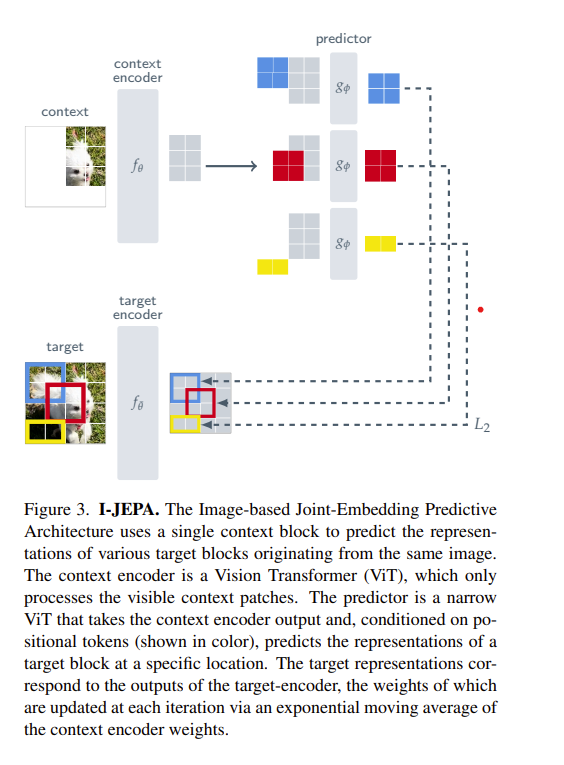

# JEPAs
Un-official PyTorch implementations of:
- [x] I-JEPA: [Self-Supervised Learning from Images with a Joint-Embedding Predictive Architecture](https://arxiv.org/abs/2301.08243)
- [x] V-JEPA: [Revisiting Feature Prediction for Learning Visual Representations from Video](https://arxiv.org/abs/2404.08471)
- [x] T-JEPA: Self-Supervised Learning from Text with a Joint-Embedding Predictive Architecture (Original Works)
- [ ] (In progress) A-JEPA: Self-Supervised Learning from Audio with a Joint-Embedding Predictive Architecture (Original Works)
- [ ] MC-JEPA: [MC-JEPA: A Joint-Embedding Predictive Architecture for Self-Supervised Learning of Motion and Content Features](https://arxiv.org/abs/2307.12698)
- [ ] Graph-JEPA: [Graph-level Representation Learning with Joint-Embedding Predictive Architectures](https://arxiv.org/abs/2309.16014)

## JEPAs Explained
Joint-Embedding Predictive Architectures (JEPAs) utilise latent space representations to learn rich semantic understandings of inputs.
This is achieved via a method called **self-distillation** - in which a model's latent space representations form its own prediction targets, thus supervising its own learning.
Many self-supervised techniques learn from the *structure implicit in data signals,* rather than relying on labels for supervision.
The JEPA paradigm takes this one step further - it incentivises the learning of progressively more expressive models (interpretations and dynamics) of input data signals by tasking itself with *learning from the structure of its internal model of those input data signals:*
  After interpreting a signal, the model tests itself by predicting *its own interpretation of the input signal* - thus it learns to structure its percepts, and learns to the structure of its internal model of the structured external world - developing a progressively more sophisticated "world model".

## Image-JEPA Schematic:


## Usage:
### Configs
The scripts in this repo are heavily dependent on JSON configurations.
These must be set up before execution.

### Datasets
This repo has (optional) placeholder folders for organising local datasets.
Datasets **do not** need to be physically stored within these fodlers - instead, you can **link externat dataset locations** using symbolic links.

For example:
```bash
ln -s /path/to/data/video/kinetics /path/to/jepas/data/video/kinetics
```


### E.g. I-JEPA Pretraining
After setting up the config and dataset, running a pretraining job cam be executed with the following command:
```bash
python pretrain_IJEPA.py
```

### E.g. I-JEPA Finetuning
I-JEPA can be utilised as a pretrained image backbone and finetuned for downstream tasks.
Task-specific model adaptations must first be implemented, and a finetune script created.
Much of the pretraining scripts in this repo can then serve as boilerplate for downstream finetuning.
For inspiration, see [gaasher](https://github.com/gaasher)'s [`finetune_IJEPA.py`](https://github.com/gaasher/I-JEPA/blob/main/finetune_IJEPA.py).

## Supervised Research Projects
I [Yunus Skeete](https://www.linkedin.com/in/yunus-skeete/) supervise academic research projects into JEPAs and World Models, using this repo for illustrative purposed.
Example projects include:
- TR-JEPA: "Can a unified image-video architecture leverage the spatiotemporal dynamics of video as an inductive bias to self-distill temporal representations into static image embeddings (spatial), enabling temporal reasoning from single frames?" (Ahmad Ajmal | Middlesex University, SpaceForm Technologies | 2024)
- IA-JEPA: "Can energy-based masked latent prediction can serve as a general-purpose mechanism for aligning visual and auditory modalities in multi-modal JEPAs? Do the spatial inductive biases of masked image modeling contribute to spatial alignment and assist visual sound localisation?" (Florence Lei | University of Bristol, Spatial Intelligence | 2025)
- ID-JEPA: "To what extent can variational regularisation of latent spaces of latent self-supervised predictive models assist multi-modal JEPA models in learning RGB-image-grounded internal representations that reflect depth, geometric and semantic understanding of the 3D world?" (Tung Lam | University of Bristol, Spatial Intelligence | 2025)

## Acknowledgements
- The implementations in this repo were inspired by [gaasher](https://github.com/gaasher/I-JEPA/tree), and utilise [@lucidrains](https://github.com/lucidrains) x-transfromers (https://github.com/lucidrains/x-transformers).

## Citation:
```
@article{assran2023self,
  title={Self-Supervised Learning from Images with a Joint-Embedding Predictive Architecture},
  author={Assran, Mahmoud and Duval, Quentin and Misra, Ishan and Bojanowski, Piotr and Vincent, Pascal and Rabbat, Michael and LeCun, Yann and Ballas, Nicolas},
  journal={arXiv preprint arXiv:2301.08243},
  year={2023}
}
```
